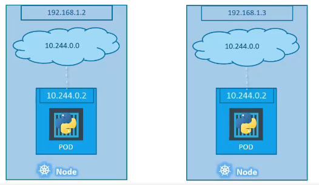

# Redes

* O nó do kubernetes possui um endereço de rede. Se você não estiver usando linux, a máquina virtual terá um IP, e o nó do K8s terá outro. 
* Quando o K8s é iniciado, ele cria uma rede privada interna. Conforme os pods são criados, ele associa um endereço IP dentro dessa rede.

* Dois pods, rodando em nós diferentes de um cluster, usando a mesma imagem, com o mesmo container, podem ter o mesmo endereço IP associado.



* Crie o arquivo `service.yml`

```yml
apiVersion: v1
kind: Service
metadata:
  name: myapp-service
spec:
  type: NodePort
  selector:
    app: myapp
  ports:
  - port: 80
    targetPort: 80
    nodePort: 30004
```

* No terminal, execute o comando `create`.

```bash
kubectl create -f service.yml
```

* Para verificar se o serviço está funcionando corretamente, execute o comando `get svc`

```bash
kubectl get svc
NAME            TYPE        CLUSTER-IP      EXTERNAL-IP   PORT(S)        AGE
kubernetes      ClusterIP   10.96.0.1       <none>        443/TCP        2m58s
myapp-service   NodePort    10.100.32.174   <none>        80:30004/TCP   87s
```

## Cluster IP

* Um sistema possui serviços em diferentes camadas, como o _frontend_, _backend_ e o banco de dados. Ao criar réplicas, cada uma delas ganha um endereço de IP diferente. Além disso, sempre que uma réplica falha, o K8s cria uma nova instância e atribui a ela um endereço de IP aleatório. Isso exige que a comunicação entre esses serviços não seja feita pelo IP, mas por uma interface, que permita acessar os diferentes pods, sem a necessidade de conhecer o endereço de rede de cada um deles. O nome dessa interface é o ClusterIP. 


```yml
apiVersion: v1
kind: Service
metadata:
  name: myapp-cluster-ip
spec:
  type: ClusterIP
  selector:
    app: myapp
  ports:
  - port: 80
    targetPort: 80
```

## Load balancer

* Para permitir que um serviço esteja acessível na rede externa, criamos um serviço do tipo NodePort. Contudo, se nossos pods estiverem distribuídos entre nós diferentes em um cluster, cada nó exigirá um NodePort. Sem falar que, diferentes serviços do tipo _edge_ também vão exigir diferentes NodePorts, ainda que estejam executando no mesmo nó.
* LoadBalancer é uma interface que centraliza e distribui as requisiçoes entre NodePorts, assim como o IpCluster distrubui as requisições entre diferentes réplicas dentro de um mesmo nó do cluster.

```yml
apiVersion: v1
kind: Service
metadata:
  name: myapp-load-balancer
spec:
  type: LoadBalancer
  selector:
    app: myapp
  ports:
  - port: 80
    targetPort: 80
    nodePort: 30008
```

* Como estamos como um único nó em nosso cluster (uma única instalação do K8s), ao criar o serviço acima, ele se comportará como um NodePort. Contudo, a implantação desse serviço em um provedor de computação em nuvem, terá o efeito de um balanceamento de carga, uma vez que esses provedores costumam distribuir as réplicas de serviços entre nós diferentes.


