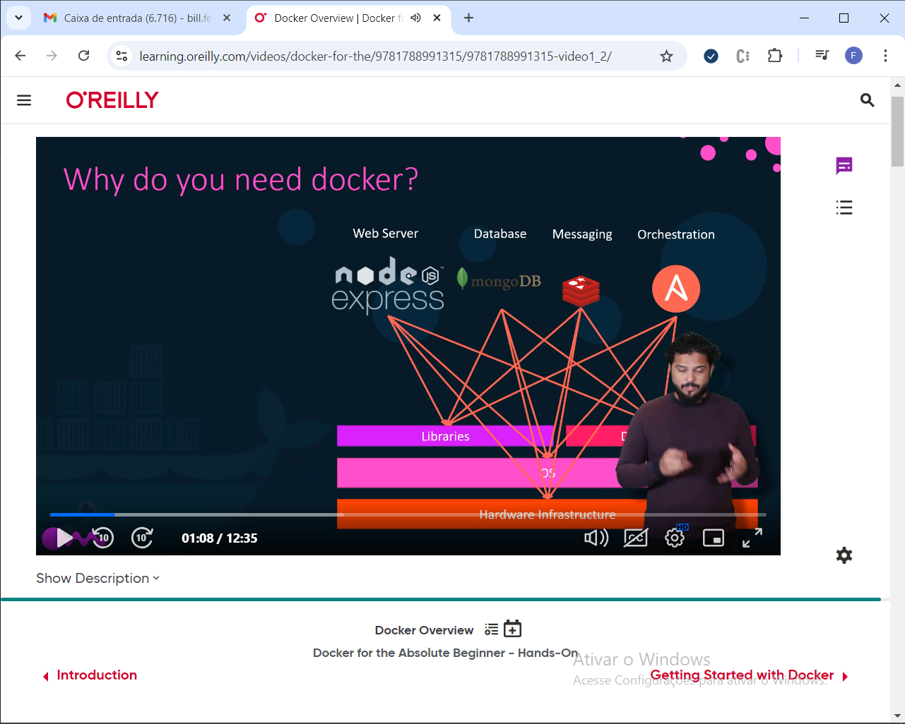
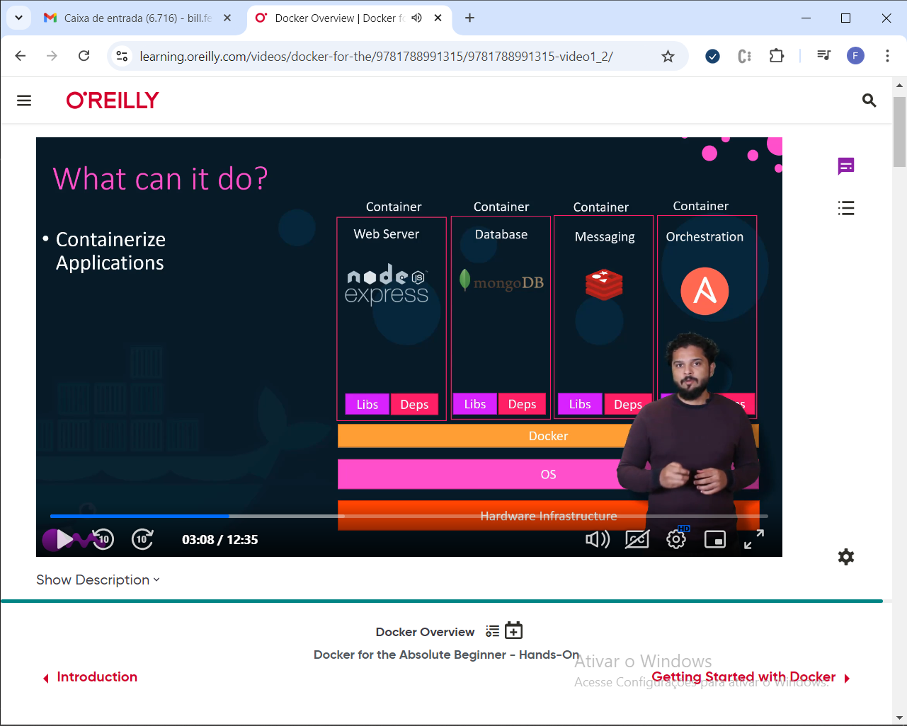
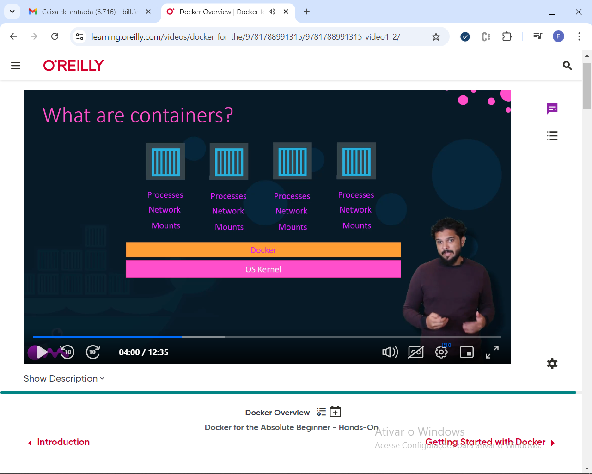
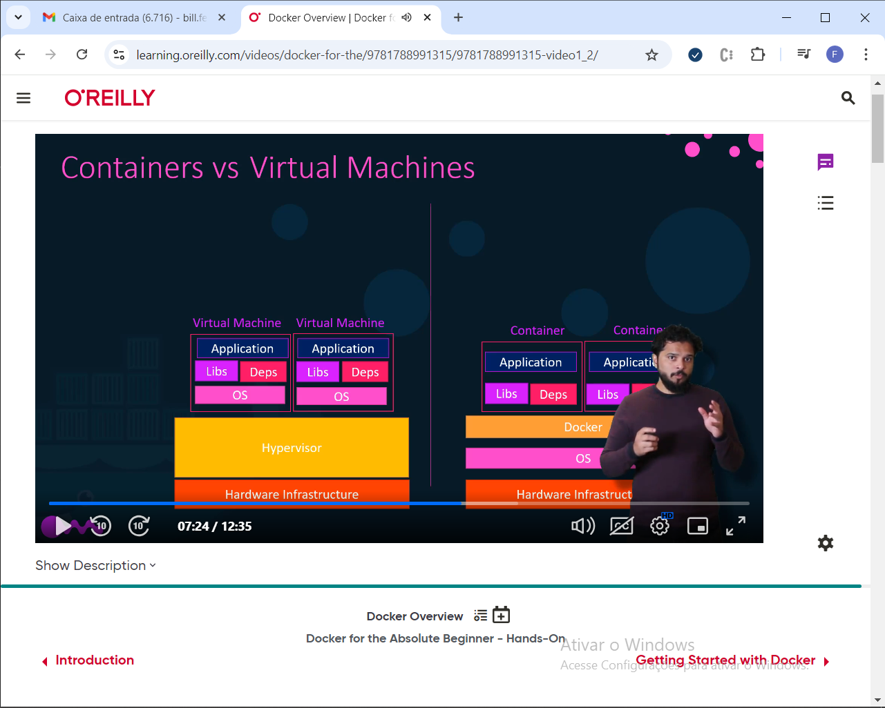

# Introdução

* Quando um sistema é composto por diversos serviços, que dependem de versões espec´ficias do sistema operacional, suas bibliotecas, ou do hardware
* Quando um novo dev entra no projeto, as diferenças de ambiente criam um problema para manter a aplicação funiconaod
* Quando a aplicação vai para operação, há diferenças nos ambientes
* As dependêncisa internas são resolvidas com um gerenciador de dependnecias, mas existem bibliotecas do OS, drivers do servidor de aplicação, dependencias desse servidor com o OS, e configurações externalizadas que devem ser feitas manualmente





* Uma alternativa é separar cada serviço é uma máquina diferente
* Para colocar o serviço em operação, o dev pode acessar o servidor com ssh

* Containers são ambientes que possuem processos, rede e volumes isolados; compartilahndo apenas o kernel



* VMS possuem um sistema operacional host dentro da imagem, que é executado sobre o hypervisor
* Um container, por outro lado, possui apenas as libs e deps. Docker abstrai o acesso ao sistema operacional, o que faz o cantainer ser mais leve



# Getting started

```bash
docker run nginx
docker ps
docker ps -a
docker stop container_id
docker rm container_id

docker images
docker rmi nginx

docker pull nginx
```

* um contianer morre qunado não há nenhum processo executando dentro dele

```bash
docker run ubuntu
docker ps
```

```bash
docker run -d centos sleep 20
```

```bash
docker run -it centos bash
```

```bash
docker run kodekloud/simple-webapp
```

* Para executar em `background`

```bash
docker run -d kodekloud/simple-webapp
```

* Para associar o terminal do host ao terminal do container

```bash
docker attach container_id
```

* Para parar a execução

```bash
docker stop
```

```bash
docker rm {container_id}
```

```bash
docker rmi {image_id}
```

```bash
docker exec {container_id} cat /etc/*release* 
```

# Docker run

```bash
docker run redis:4.0
```

* modo iterativo


```bash

```

# port mapping

* O IP associado pelo docker host é interno, e só pode ser acessado do mesmo nó de rede
* Para acessar externamente, é necessário associar a porta do container a uma porta livre no host

```bash
docker run -p 80:5000 kodekloud/simple-webapp
docker run -p 8000:5000 kodekloud/simple-webapp
docker run -p 3306:3306 mysql
docker run -p 3306:3306 mysql
```

# volumes

```bash
docker run mysql
docker stop mysql
docker rm mysql

docker run -v /opt/datadir:/var/lib/mysql mysql
```

```bash
docker inspect {container_id}
```

```bash
docker logs {container_id}
```

* mapear um volume com jenkins

```bash

docker run jenkins....
```

## images

```dockerfile
FROM ubuntu

RUN apt-get update
RUN apt-get install python

RUN pip install flask
RUN pip install flask-mysql

COPY . /opt/source-code

ENTRYPOINT FLASK_APP=/opt/source-code/app.py flask run
```

```bash
docker build Dockerfile -t mycustom-app

docker push 
```

```python
import os
from flask import flask
app = Flask(__name__)

@app.route("/")
def main():
    return "Welcome"

@app.route("/how are you")
def hello():
    return "good"

if __name__ == "__main__":
    app.run()
```

* executar localmente
* construir a imagem e executar pelo docker

# variaveis de ambiente

```python
import os
from flask import Flask

app = Flask(__name__)
...
color = os.environ.get("APP_COLOR")

```


* Para obter as variaveis, execute o comando `inspect`
* Na seção config, env

> https://github.com/kodekloudhub/webapp-color/blob/master/app.py

```bash
docker run -e APP_COLOR=blue simple-webapp-color
```

## command vs entry point

* um container só vive enquanto o processo dentro dele está rodando
* o que define qual processo está associado ao  container é o CMD
* se o comando for um bash, é necessário associá-lo ao terminal, no modo iterativo
* uma maneira de forçar que o terminal permaneça em execução, é utilizando o comando sleep

```bash
docker run ubuntu sleep 5
```

* No exemplo acima, `Sleep 5` é o comando que associa o ciclo de vida do container a um processo
* Para evitar que o comando seja passado toda vez que o contianer é iniciado, é possível movê-lo para a definição da imagem

```Dockerfile
CMD ["command" , "param1"]
CMD ["sleep" , "5"]
```

* Agora, basta invocar a imagem customizada (ubuntu-sleeper), sem o parâmetro

```bash
docker run ubuntu-sleeper 
```

* Para sobrescrever o comando padrão, é possível fornecer o comando 

```bash
docker run ubuntu-sleeper sleep 10
```

* Outra forma de fazê-lo, é por meio de um entrypoint

```Dockerfile
ENTRYPOINT["sleep"]
CMD["5"]
```

* No exemplo acima, definimos um _entrypoint_, seguido de um comando, que estabelece seu valor padrão. As três formas de executar o container abaixo são válidas

```bash
docker run ubuntu-sleeper #executa sleep 5
docker run ubuntu-sleeper 10 #executa sleep 10
docker run ubuntu-sleeper sleep 15 #executa sleep 15
```

* Para passar os parâmetros dos comandos para um arquivo separado por ambiente, é possível usar um arquivo `entrypoint` separado

```bash
docker run --entrypoint sleep2.0 ubuntu-sleeper 10
```

# docker compose

```bash 
docker pull ghcr.io/dockersamples/example-voting-app-result:after
docker pull ghcr.io/dockersamples/example-voting-app-vote:after
docker pull ghcr.io/dockersamples/example-voting-app-worker:latest
```

> https://github.com/dockersamples/example-voting-app

```bash
docker run -d --name=redis redis

docker run -d --name=db postgres

docker run -d --name=vote -p 5000:80 --link redis:redis voting-app

docker run -d --name=result -p 5001:80 --link db:db result-app

docker run -d --name=worker --link db:db --link redis:redis worker
```

```yml
version: 1
redis:
  image: redis
db:
  image: postgres:9.4
vote:
  image: voting-app
  ports: 
    - 5000:80
  links:
    - redis
result:
  image: result-app
  ports:
    - 5001:80
  links:
    - db
worker:
  image: worker
  links:
    - redis
    - db 

```

* A versão 3 automaticamente cria uma rede do tipo bridge

```yml
version: 3
services:
  redis:
    image: redis
  db:
    image: postgres:9.4
    environment:
      - POSTGRES_USER: postgres
      - POSTGRES_PASSWORD: postgres
    networks:
      - backend
  vote:
    image: voting-app
    ports: 
      - 5000:80
    depends_on:
      - redis
    networks:
      - backend
      - frontend
  result:
    image: result-app
    ports:
      - 5001:80
    networks:
      - backend
      - frontend
  worker:
    image: worker
networks:
  frontend:
  backend:
```

# registry

* repositório no qual ficam hospedadas as imagens docker

```bash
docker login private-registry.io

docker push .... 

docker run ...
```

# storage

```bash
docker volume create data_volume

docker run -v data_volume:/var/lib/mysql mysql
```

* ao criar um volume, docker cria um diretório sob o path `var/lib/docker/volumes`
* para associar os dados de um container a um diretório em outro caminho, deve-se usar o bind mounting

```bash
docker run -v /data/mysql:/var/lib/mysql mysql
```

* modo verboso

```bash
docker run --mount type=bind, source=/data/mysql, target=/var/lib/mysql mysql
```

# Redes

```bash
docker run ubuntu
docker run ubuntu --network=none
docker run ubuntu --network=host
```

* a rede bridge é uma vpn criada pelo docker no host. Todos os containers criados são associados a ela, recebendo um IP. Containers podem se comunicar entre si, inclusive por meio de dns. para que o container seja acessível externamente, é necessário fazer um mapeamento de portas com as ports do host

* outra maneira de permitir o acesso externo é por meio da rede host. ao associar a um container  a rede host, sua porta é automaticamente mapeada para a mesma porta do host. Por isso, não é possível mapear multiplos containers à rede host, pois eles sempre terão a mesma porta exposta

* a rede none não é acessada externamente, rodando de foram completamente isolada

* também é possível criar e isolar uma rede customizada

```bash
docker network create --driver bridge --subnet 182.18.0.0/16 custom-network
docker network ls
docker inspect {container_id}
```

* containers podem acessar uns aos outros pelo ip, ou pelo nome dns

