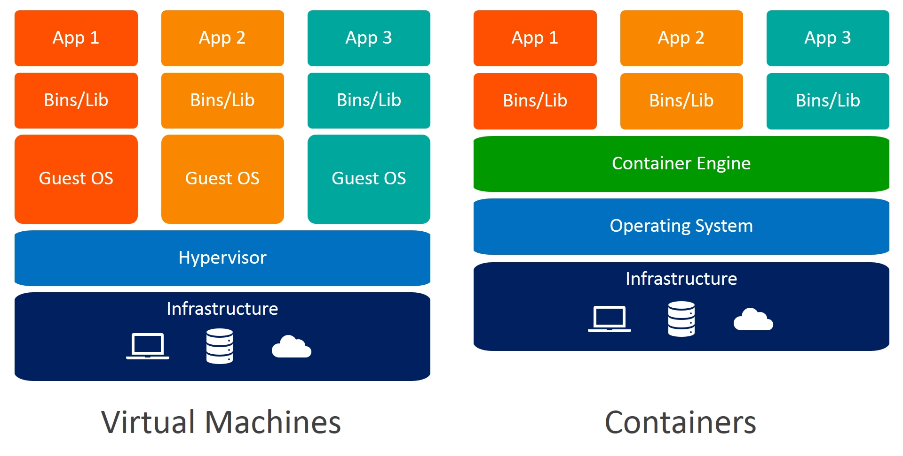
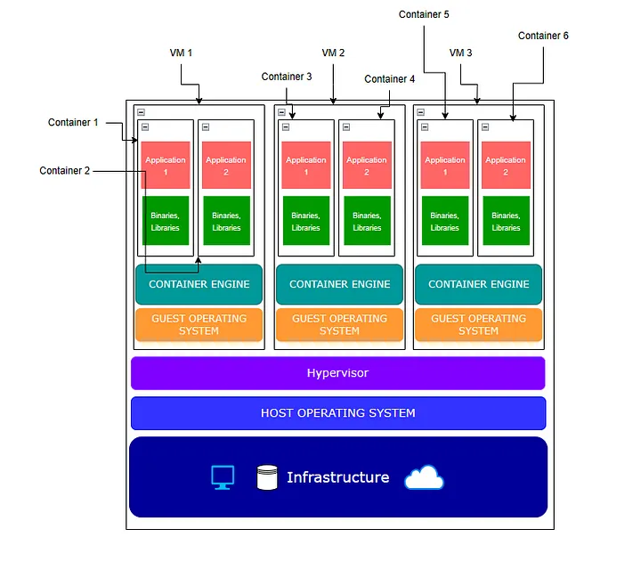
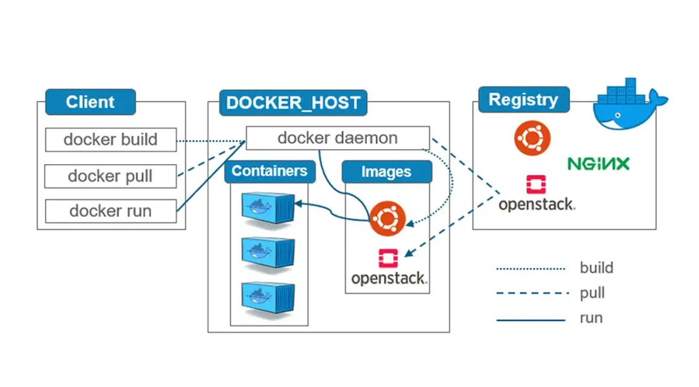

# Introdução

Os containers resolvem o problema de inconsistência entre ambientes (por exemplo, entre desenvolvimento, testes e produção; assim como entre diferentes desenvolvedores) ao garantir que a aplicação rode da mesma forma, independentemente do sistema host. Eles fornecem uma solução eficiente para isolamento de processos e empacotamento de aplicações, facilitando o desenvolvimento, implantação e escalabilidade.

* Um container não possui um sistema operacional próprio, ao invés disso ele utiliza uma abstração fornecida pelo _daemon_, para não depender de recursos específicos do sistema operacional do _host_.
* Containers são processos isolados entre si, mas compartilham recursos físicos do _host_, como o _kernel_, memória, processamento, armazenamento e rede.

## Containers vs máquinas virtuais



Máquinas virtuais executam um sistema operacional completo sobre um hypervisor (software de virtualização), que pode ser diferente do SO do _host_. Cada VM inclui um kernel próprio e precisa de mais recursos (memória, CPU, armazenamento). Máquinas virtuais oferecem isolamento completo ao nível de sistema operacional, pois cada VM tem seu próprio SO. Isso garante maior separação entre as aplicações. Como uma VM inclui o sistema operacional completo, seu tamanho é muito superior ao de um container.

Containers compartilham o kernel do sistema operacional do host, mas cada container tem seu próprio espaço de usuário, bibliotecas e dependências. Isso os torna muito mais leves e eficientes em termos de uso de recursos. Containers oferecem isolamento a nível de processo dentro do mesmo sistema operacional. Eles são menos isolados em comparação com VMs, mas suficientemente isolados para muitos casos de uso. Como os containers compartilham o kernel do _host_, não precisam incluir o SO, o que os torna mais leves.

Dependendo da necessidade, é possível provisionar máquinas virtuais, para hospedar containers, garantindo isolamento e segurança; assim como otimizando o uso de recursos computacionais.



## Introdução ao Docker

* __Docker__ é a mais popular tecnologia de containers. São soluções alternativas: Podman, Linux Containers, rkt, kata e cri-o.
* 



São componentes do __Docker__:

1. __Client__: a interface com a qual os usuários interagem diretamente. É um utilitário usado para executar comandos no __server__. Quando você executa comandos como docker run ou docker build, esses comandos são passados do cliente para o Docker Daemon (servidor) para serem processados. Ao executar um comando `docker` no terminal, o __client__ é instanciado, conecta-se ao __server__, executa o comando, e depois finaliza o processo.
1. __Host__: o sistema onde o __Docker__ é executado, podendo ser uma máquina local ou remota; inclui o Docker Daemon, as Imagens e os Containers. O _host_ gerencia todos os containers que são criados e executados nele. Se o __Docker desktop__ foi instalado no Windows ou Mac, o __Docker engine__ executará dentro de uma máquina virtual linux. Pode-se dizer que essa VM é o _host_. Se foi instalado no linux, o __Docker engine__ será executado diretamente na máquina linux, sendo portanto, o próprio _host_ dos processos do __server__.
1. __Daemon (server)__: serviço de fundo que escuta solicitações do Docker Client e gerencia a construção, execução e parada dos containers. O daemon também gerencia o ciclo de vida dos containers, além de gerenciar imagens, volumes e redes.
1. __Images__: um modelo imutável que contém todos os dados e metadados necessários para rodar uma aplicação.
As imagens são construídas a partir de uma série de camadas (layers), onde cada camada representa uma instrução no arquivo Dockerfile (por exemplo, copiar arquivos, instalar dependências, etc.). As imagens são lidas de forma apenas leitura (read-only) e podem ser distribuídas entre diferentes hosts e plataformas.
1. __Containers__: uma instância executável de uma Imagem do Docker. Ele contém a aplicação e todas as suas dependências, além de rodar de forma isolada em relação a outros containers e ao sistema host. Os containers são baseados em imagens, mas ao contrário das imagens (imutáveis), os containers podem ser alterados durante sua execução. Eles compartilham o kernel do sistema operacional do host, mas são executados em espaços de usuário isolados.
1. __Repository__: é um local no qual múltiplas versões de imagens são armazenadas. Cada repositório contém uma série de imagens (por exemplo, nginx:latest, nginx:1.19, etc.). Você pode puxar (pull) ou empurrar (push) imagens para ou a partir de um repositório.
1. __Registry__: serviço que hospeda repositórios de imagens Docker. Ele permite que você armazene e distribua imagens Docker. O Docker Hub é o registry público padrão fornecido pela Docker, mas você também pode configurar um Registry privado para armazenar imagens internas. Os registries são usados para distribuir imagens Docker em diferentes ambientes.

## Prática 1

* Para verificar a versão do __client__, utilize o comando `docker version`
* Para melhor perceber a diferença entre o __client__ e o __server__, finalize a execução do __Docker Desktop__ (__Docker Engine__ no linux), e repita o comando `docker version`.

```bash
docker version
```

```console
Client:
 Version:           26.1.4
 API version:       1.45
 Go version:        go1.21.11
 Git commit:        5650f9b
 Built:             Wed Jun  5 11:29:54 2024
 OS/Arch:           windows/amd64
 Context:           desktop-linux
error during connect: Get "http://%2F%2F.%2Fpipe%2FdockerDesktopLinuxEngine/v1.45/version": open //./pipe/dockerDesktopLinuxEngine: O sistema não pode encontrar o arquivo especificado.
```

* No exemplo acima, o __client__ foi identificado, mas o comando não retornou os dados sobre o __server__, pois ele estava indisponível.

* Com o __Docker Engine/Desktop__ em execução, repita o comando `docker version`.

```bash
docker version 
```

```console
Client:
 Version:           26.1.4
 API version:       1.45
 Go version:        go1.21.11
 Git commit:        5650f9b
 Built:             Wed Jun  5 11:29:54 2024
 OS/Arch:           windows/amd64
 Context:           desktop-linux

Server: Docker Desktop 4.31.1 (153621)
 Engine:
  Version:          26.1.4
  API version:      1.45 (minimum version 1.24)
  Go version:       go1.21.11
  Git commit:       de5c9cf
  Built:            Wed Jun  5 11:29:22 2024
  OS/Arch:          linux/amd64
  Experimental:     false
 containerd:
  Version:          1.6.33
  GitCommit:        d2d58213f83a351ca8f528a95fbd145f5654e957
 runc:
  Version:          1.1.12
  GitCommit:        v1.1.12-0-g51d5e94
 docker-init:
  Version:          0.19.0
  GitCommit:        de40ad0
```

## Prática 2

* No terminal, execute o comando `docker run hello-world`.

```bash
docker run hello-world
```

```console
Unable to find image 'hello-world:latest' locally
latest: Pulling from library/hello-world
c1ec31eb5944: Download complete
Digest: sha256:91fb4b041da273d5a3273b6d587d62d518300a6ad268b28628f74997b93171b2
Status: Downloaded newer image for hello-world:latest

Hello from Docker!
This message shows that your installation appears to be working correctly.

To generate this message, Docker took the following steps:
 1. The Docker client contacted the Docker daemon.
 2. The Docker daemon pulled the "hello-world" image from the Docker Hub.
    (amd64)
 3. The Docker daemon created a new container from that image which runs the
    executable that produces the output you are currently reading.
 4. The Docker daemon streamed that output to the Docker client, which sent it
    to your terminal.

To try something more ambitious, you can run an Ubuntu container with:
 $ docker run -it ubuntu bash

Share images, automate workflows, and more with a free Docker ID:
 https://hub.docker.com/

For more examples and ideas, visit:
 https://docs.docker.com/get-started/
```

* Como a imagem __hello-world__ não pode ser encontrada, o __Docker Host__ se encarregará de buscá-la no __Docker Hub__.

* Como nenhum processo foi associado ao container, sua execução terminou.

* Para verificar quais container estão em execução, use o comando `docker ps` no terminal.

```bash
docker ps
```

```console
CONTAINER ID   IMAGE     COMMAND   CREATED   STATUS    PORTS     NAMES
```

* No caso, não temos nenhum container em execução.

* Para verificar todos os containers, inclusive aqueles que terminaram de executar, use o comando `docker ps -a` no terminal.

```bash
docker ps -a
```

```console
CONTAINER ID   IMAGE         COMMAND    CREATED          STATUS                      PORTS     
NAMES
0534d10a0bb7   hello-world   "/hello"   11 minutes ago   Exited (0) 11 minutes ago
vibrant_thompson
```

* Para verificar as imagens disponíveis localmente, execute o comando `docker images`.

```bash
docker images
```

```
REPOSITORY                                TAG
                         IMAGE ID       CREATED         SIZE
docker/desktop-kubernetes                 kubernetes-v1.29.2-cni-v1.4.0-critools-v1.29.0-cri-dockerd-v0.3.11-1-debian   ee4d0cb41223   6 months ago    629MB
registry.k8s.io/kube-apiserver            v1.29.2
                         fe4196cd9fa0   7 months ago    166MB
registry.k8s.io/kube-proxy                v1.29.2
                         4a993783f8b8   7 months ago    114MB
registry.k8s.io/kube-controller-manager   v1.29.2
                         4ac9c5b9e65b   7 months ago    159MB
registry.k8s.io/kube-scheduler            v1.29.2
                         108e51c8bcd2   7 months ago    81.3MB
registry.k8s.io/etcd                      3.5.10-0
                         22f892d7672a   11 months ago   208MB
registry.k8s.io/coredns/coredns           v1.11.1
                         1eeb4c7316ba   13 months ago   82MB
docker/desktop-vpnkit-controller          dc331cb22850be0cdd97c84a9cfecaf44a1afb6e
                         7ecf567ea070   16 months ago   47MB
hello-world                               latest
                         91fb4b041da2   17 months ago   24.4kB
registry.k8s.io/pause                     3.9
                         7031c1b28338   23 months ago   1.07MB
docker/desktop-storage-provisioner        v2.0
                         115d77efe6e2   3 years ago     59.2MB
```

* __hello-world__ agora faz parte das imagens disponíveis em nosso __Docker host__. Ao instanciar um novo container com essa imagem, ela não será baixada novamente.

* Perceba que há outras imagens disponíveis, como o __docker-desktop__ e o __docker-kubernetes__.

## Prática 3

1. Crie um container baseado na imagem `busybox`.
1. Crie um arquivo chamado `teste.txt`. Dentro dele escreva uma mensagem qualquer.
1. Execute o comando `ls`, para verificar se o arquivo foi criado com sucesso.
1. Abra outro terminal e crie um novo container com a imagem `busybox`.
1. Execute o comando `ls` e verifique se o arquivo `teste.txt` pode ser encontrado.
1. Por fim, abra um terceiro terminal e execute o comando `docker ps`, para verificar a quantidade de instâncias do container em execução

```bash
#terminal 1

docker run -it busybox
echo "mensagem" > texte.txt
/ # echo "teste" > teste.txt
/ # ls
bin        dev        etc        home       lib        lib64      proc       root       sys        teste.txt  tmp        usr        var
```

```bash
#terminal 2

docker run -it busybox
/ # ls
bin        dev        etc        home       lib        lib64      proc       root       sys        tmp        usr        var
```

```bash
# terminal 3

docker ps
CONTAINER ID   IMAGE     COMMAND   CREATED         STATUS         PORTS     NAMES
568a13d71c76   busybox   "sh"      5 seconds ago   Up 4 seconds             kind_elgamal       
61e7c2d2ebb1   busybox   "sh"      4 minutes ago   Up 4 minutes             infallible_franklin
```

