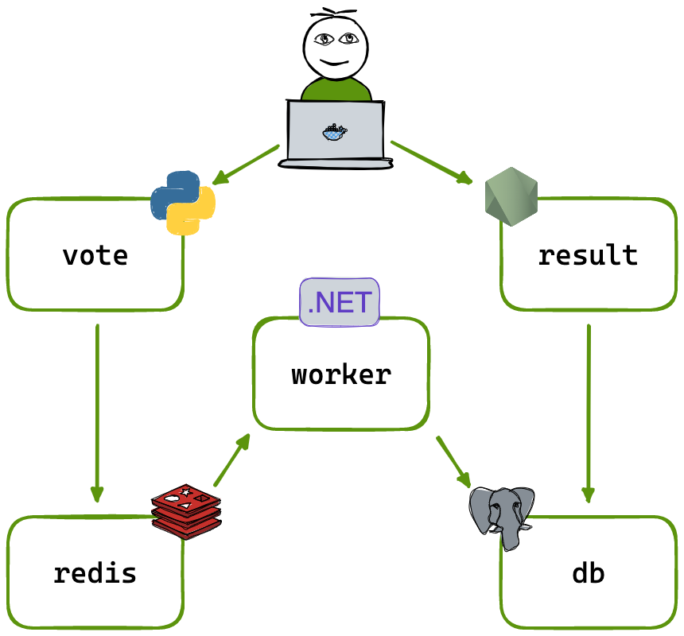

# Laboratório de microservicços

* Neste laboratório, vamos criar um sistema composto por 5 serviços:
  * Um app para votação;
  * Um app para ver o resultado;
  * Um banco de dados em memória;
  * Um banco de dados tradicional; e
  * Um worker, que transfere os dados entre os bancos.

  

* O primeiro passo será a criação de _deployments_ para cada um dos serviços.

> Dica 1: crie um diretório separado para os arquivos deste laboratório.

1. Crie um _deploy_ para o serviço `example-voting-app-vote`
1. Crie um _deploy_ para o serviço `example-voting-app-result`
1. Crie um _deploy_ para o serviço `example-voting-app-worker`
1. Crie um _deploy_ para o serviço `redis`
1. Crie um _deploy_ para o serviço `postgresql`
1. Ao final, execute o comando `apply` (ou `create`) para cada um dos _deployments_ criados.

> Dica 2: as imagens dos serviços `vote`, `result` e `worker` podem ser encontradas em: https://github.com/dockersamples/example-voting-app
>
> Utilize o comando `docker pull`, para copiá-las do __Docker Hub__ para o seu host.
> ```bash
> docker pull ghcr.io/dockersamples/example-voting-app-vote:after
> docker pull ghcr.io/dockersamples/example-voting-app-result:after
> docker pull ghcr.io/dockersamples/example-voting-app-worker:latest
> ```

* O segundo passo será a criação de um _Cluster IP_ para os bancos de dados.

1. Crie um _ClusterIP_ para o serviço __redis__
1. Crie um _ClusterIP_ para o serviço __postgres__

* O terceiro e último passo será a criação de um _NodePort_ para os serviços `vote` e `result`.
* Não é necessário criar nenhum serviço para o `worker`.
